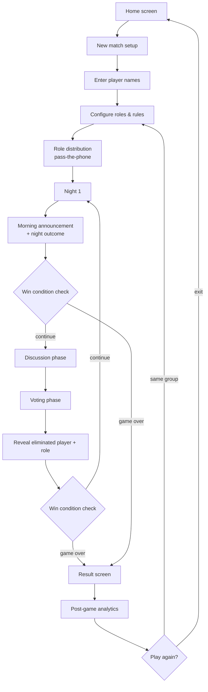
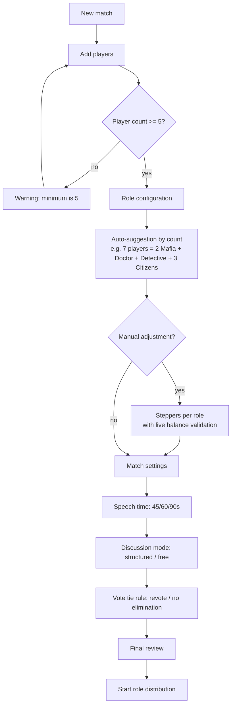
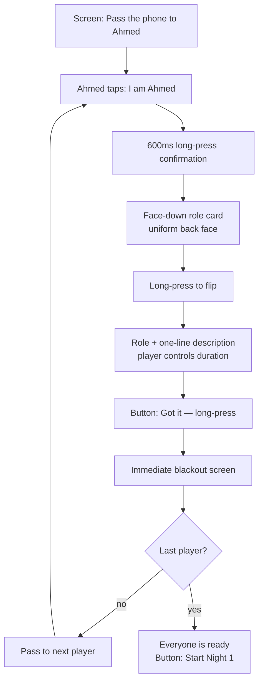
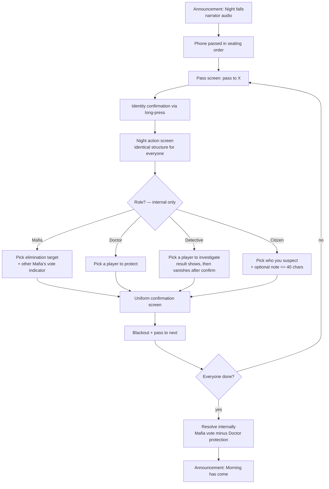
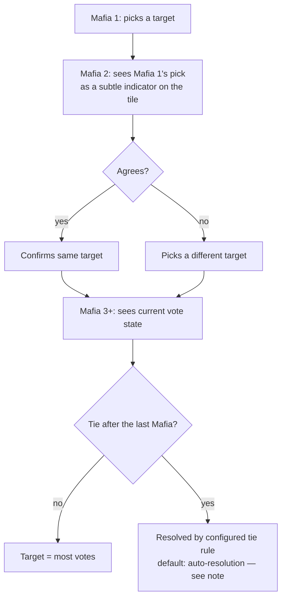
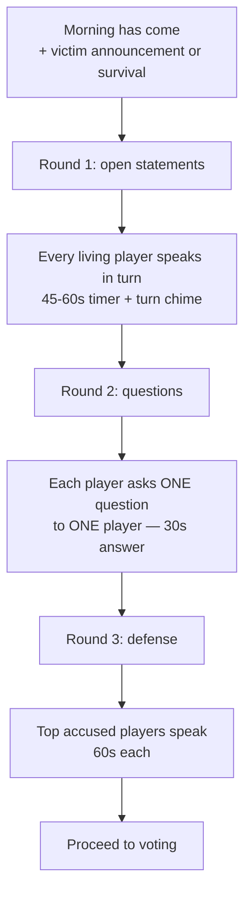
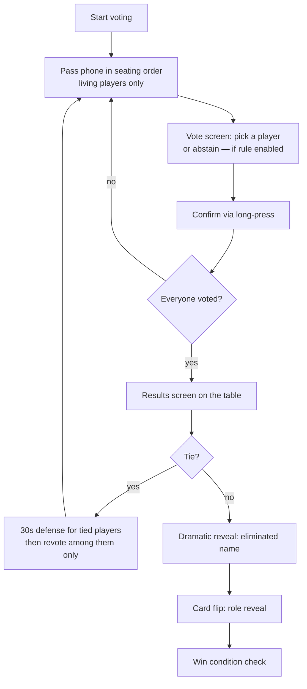
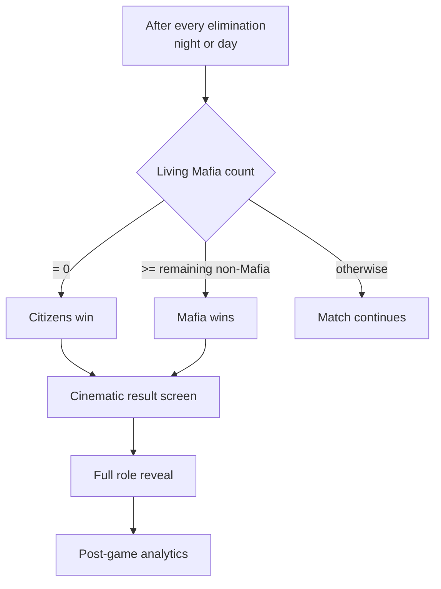
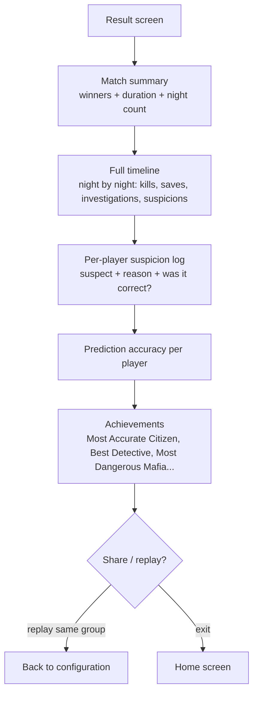

# Mafia Master — User Flows

> All diagrams are Mermaid — renderable in any Markdown viewer (VS Code, GitHub, Obsidian).

---

## 1. Match Lifecycle (Top-Level Flow)

---

## 2. Setup Flow

**Validation rules:**

| Rule | Behavior |
|---|---|
| Mafia ≥ 1 | Mandatory |
| Mafia < half of players | Block save + message |
| Doctor/Detective: 0 or more | Allowed, warning shown at 0 |
| Sum of roles = player count | Auto-balanced (Citizens = remainder) |

---

## 3. Role Distribution Flow

> **Principle:** every player goes through identical steps with the exact same number of taps.

**Anti-leakage notes:** card flip requires long-press (cannot be opened accidentally in view of others); the "Got it" button appears after a fixed 2-second delay for all roles (no timing difference between reading "Citizen" vs "Mafia").

---

## 4. Night Phase Flow — the critical one

> Internal resolution order is fixed (Mafia → Doctor → Detective), but **the phone is passed in seating order** — every player uses the phone every night regardless of role.

### 4.1 Collaborative Mafia Voting

> **Design note:** a tie-revote CANNOT require an extra phone pass (instant leak of Mafia count!). Resolution: on tie, resolve automatically per the pre-configured rule (last Mafia's pick wins, or random among tied targets). A true "revote" is only possible if the night mode supports a silent second round for ALL players. Final ruling belongs in the rules document.

---

## 5. Discussion Phase Flow (Structured Mode)

- The phone lies in the center of the table during discussion — it acts only as timer and bell.
- "Free mode": one global discussion timer, no speaking turns.

---

## 6. Voting & Elimination Flow

---

## 7. Win Check & Result Flow

---

## 8. Post-Game Intelligence Flow

---

## 9. Edge Flows

| Case | Flow |
|---|---|
| Player opens someone else's screen | Long-press identity gate blocks it; "I'm not {name}" returns to pass screen without revealing anything |
| App killed / crash | Full match state restore from local storage (Isar) to the last confirmed step |
| Player quits mid-match | From pause menu: "Remove player" → treated as neutral elimination + immediate win check |
| Back button during night | Dialog: "End match?" — never navigates back inside the night |
| Phone call during night | State saved instantly; on return, the pass screen for the same player is shown (never the action content) |
